# Sheet Material Inventory and Shipment/Job Surveys

## Table of Contents
- [Sheet Material Inventory](#sheet-material-inventory)
  - [Locations](#locations)
  - [Overview Tabs](#overview-tabs)
  - [All Other Tabs](#all-other-tabs)
  - [Table Edit Hot Keys](#table-edit-hot-keys)
  - [Blue Text Indicators](#blue-text-indicators)
- [Shipment and Job Surveys](#shipment-and-job-surveys)
  - [On Time Surveys](#on-time-surveys)
  - [Quality Surveys](#quality-surveys)
  - [Editing Surveys](#editing-surveys)
- [Light Theme UI](#light-theme-ui)

---

## Sheet Material Inventory

Sheet Material Inventory Overview:

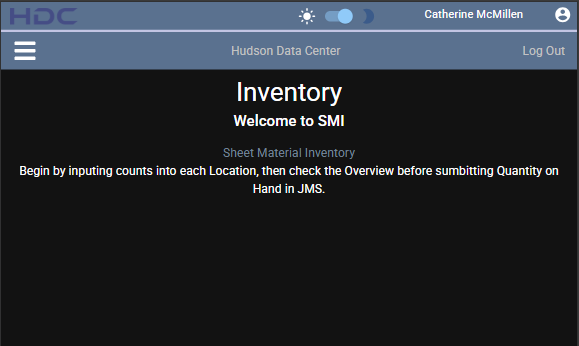

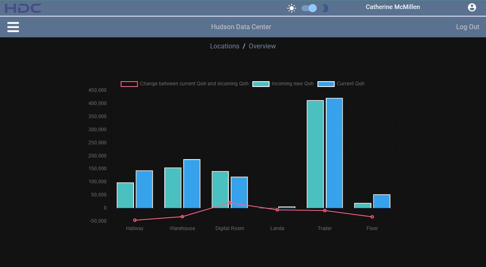

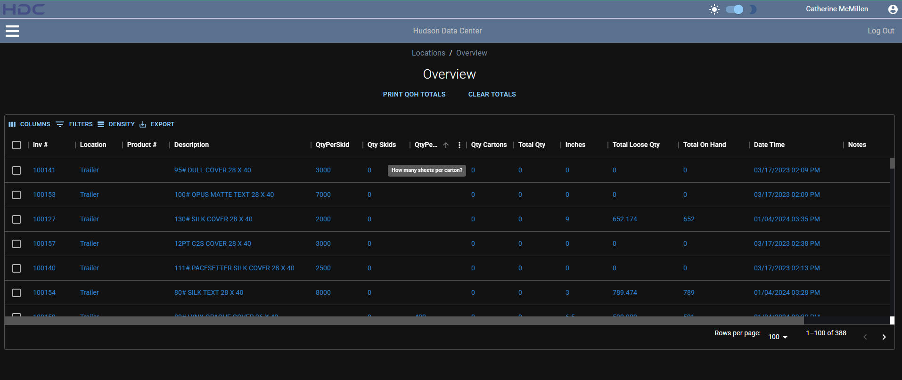

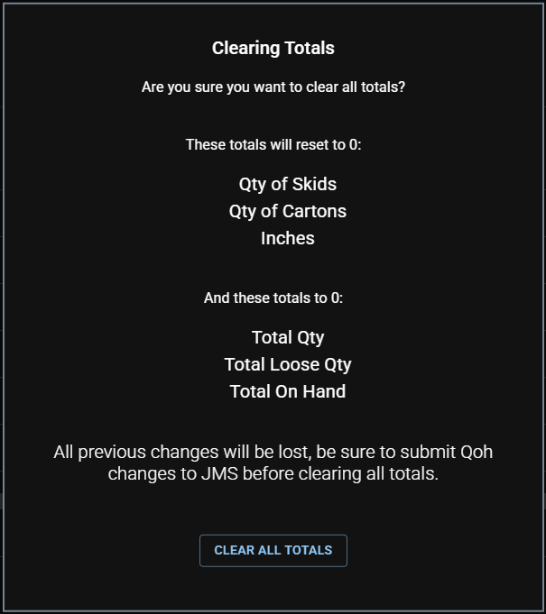

### Locations
The **Sheet Material Inventory** is divided into multiple locations, each having specific tabs for managing inventory:
- **Hallway:** Four tabs - Overview, Skids, Cartons, Misc.
- **Warehouse:** Four tabs - Overview, Skids, Cartons, Misc.
- **DigitalRoom:** Four tabs - Overview, Skids, Cartons, Misc.
- **Landa:** Four tabs - Overview, Skids, Cartons, Misc.
- **Trailer:** One Overview tab and multiple tabs for each trailer (e.g., S-170).
- **Floor:** Four tabs - Overview, Skids, Cartons, Misc.

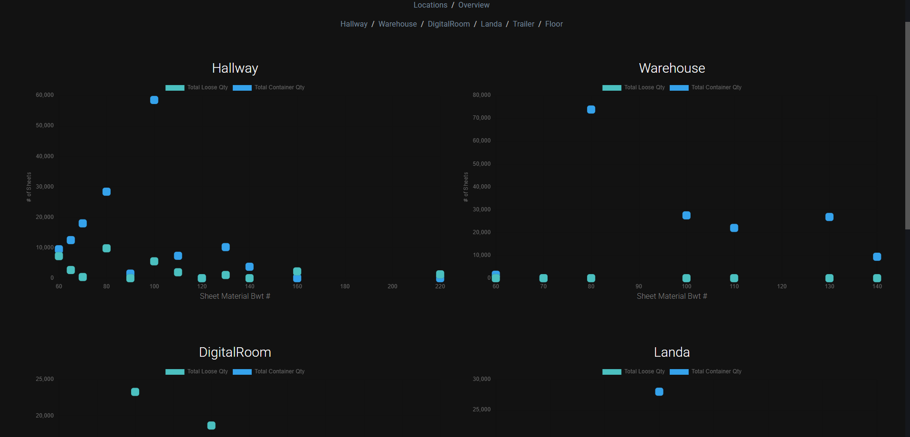

---

### Overview Tabs
- The Overview tab consolidates all rows from the other tabs within a location, with reference to the "Tab" column.
- Use the table menu for:
  - **Hidden columns**
  - **Filtering options**
  - **Density adjustments**
  - **Export to CSV (Excel sheet)**
  - **Printing**
- Hover over any column for:
  - **Sort (up arrow)** 
  - **Menu options (three vertical dots)**
- Pull Products
  - **move product to different locations**

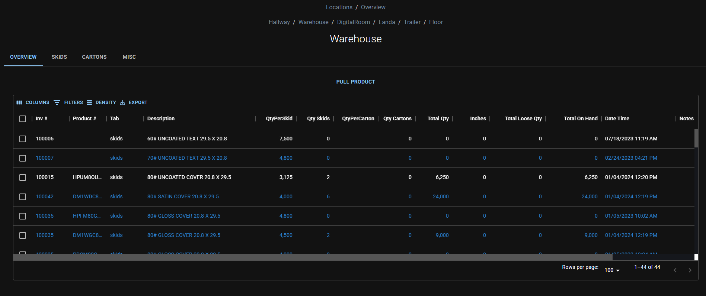

### All Other Tabs
- **Checkbox Selection:** Use checkboxes to:
  - Pull/transfer product: Enter quantities for skids, cartons, or inches. Choose a destination location from the dropdown, then click "Pull."
  - Delete rows: Select rows, confirm in the pop-up, and click "Yes."
- **Add Row Button:** Add new rows with the "Add Row" button, entering the Inv# and additional details. Submit changes using "Submit" or the **Enter hot key**.
- **Editable Columns:** Double-click to edit specific columns:
  - `QtyPerSkid`, `Qty Skids`, `QtyPerCarton`, `Qty Cartons`, `Date Time`, `Notes`

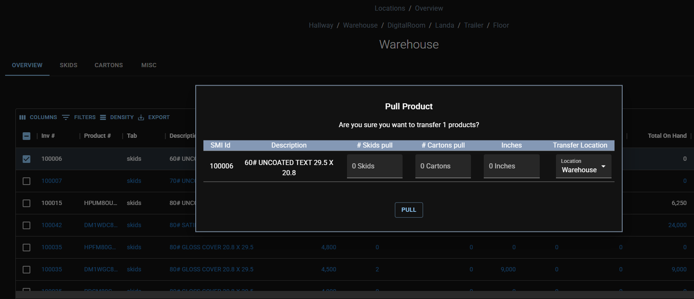

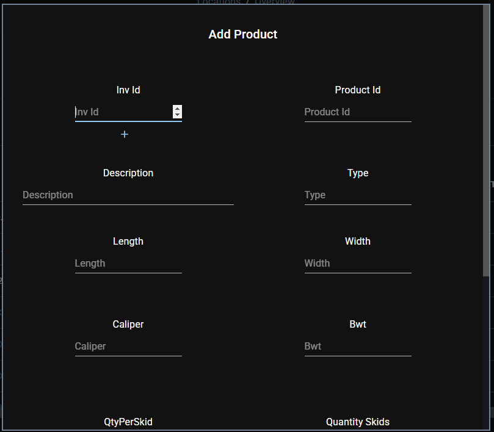

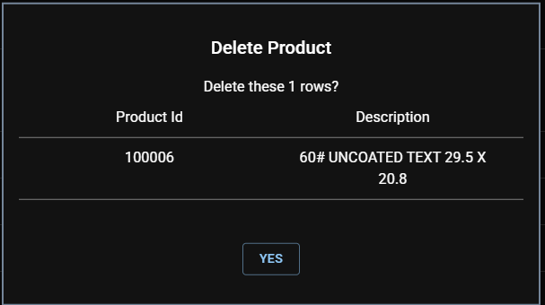

### Table Edit Hot Keys
- Double-click a cell to edit, press **Enter** to confirm and move to the cell below, repeating the process vertically within a column.

### Blue Text Indicators
- **Blue Text** in a row indicates duplicate `Inv#`:
  - On a tab: Another row in the same tab with the same `Inv#`.
  - On a location's overview: Duplicate rows for that location.
  - On the overall overview: Duplicate rows across all locations.

---

## Shipment and Job Surveys

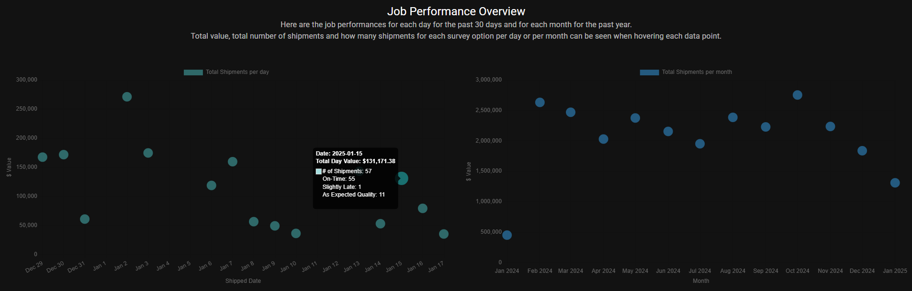

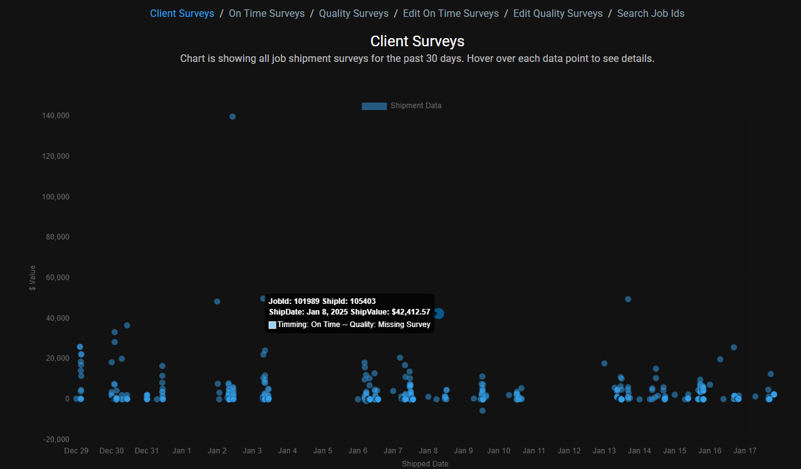

### On Time Surveys
- Navigate to: **Job Performance → Client Surveys → On Time Surveys**
- Displays daily shipment surveys, covering one day back from the current date.

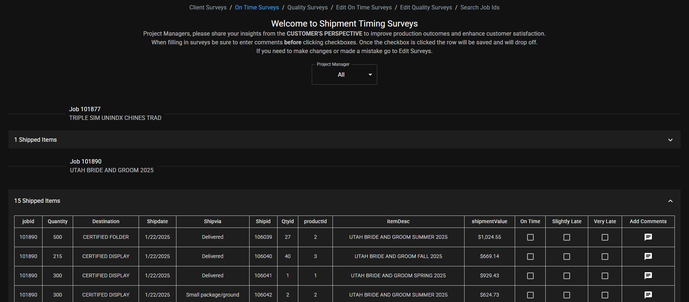

### Quality Surveys
- Navigate to: **Job Performance → Client Surveys → Quality Surveys**
- Displays job surveys, covering one day's worth of completed jobs from seven days ago.

---

### Editing Surveys
- **On Time Surveys:** Use job ID or shipment ID to search and edit/add surveys. Check daily emails for incomplete or missing surveys in the CSV file.
- **Quality Surveys:** Use job ID to search and edit/add surveys. Refer to the daily emails for missing data.

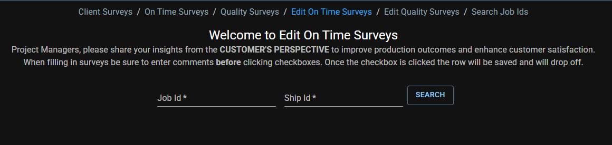

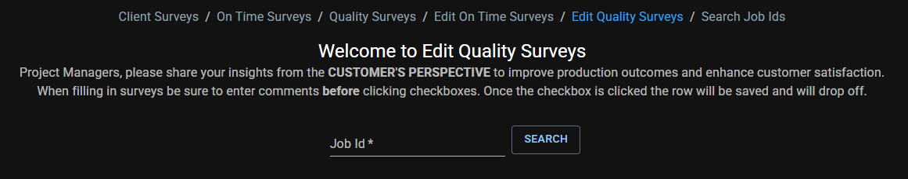

---

## Search Shipments

- **Search Shipments:** Use job ID to search JMS to find shipments, then use shipment ids to edit surveys.

---

## Light Theme UI

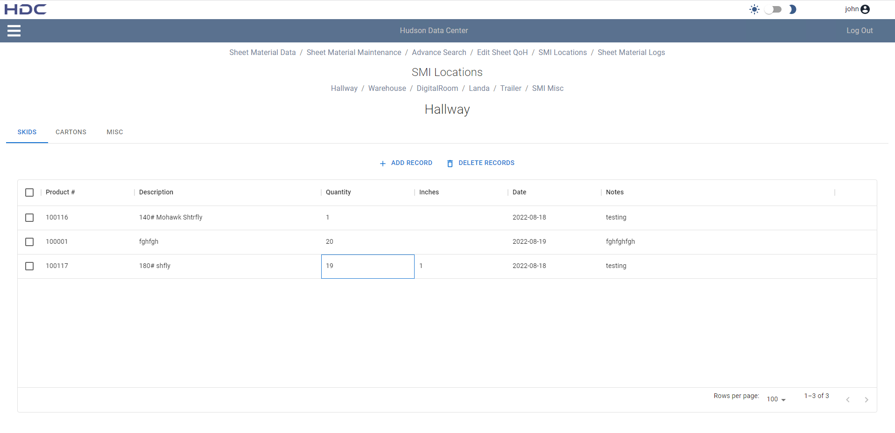

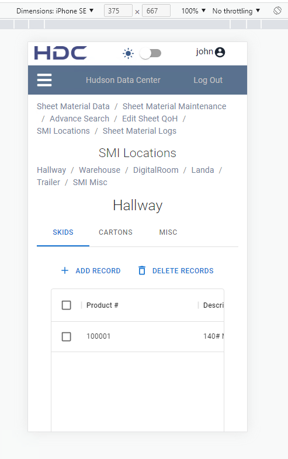
